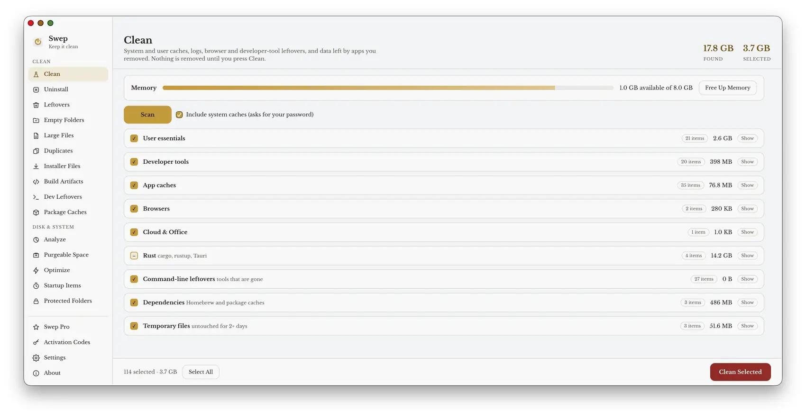
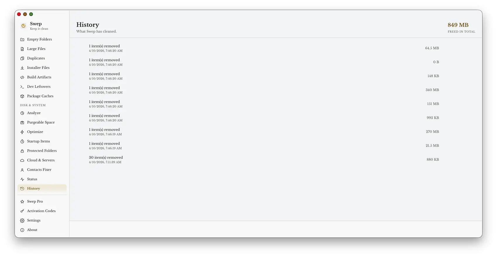
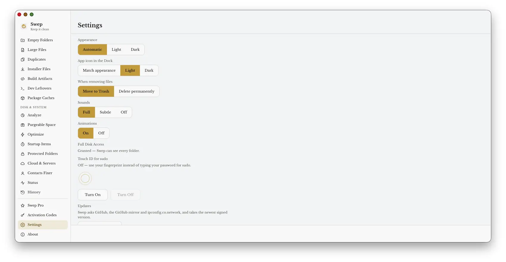
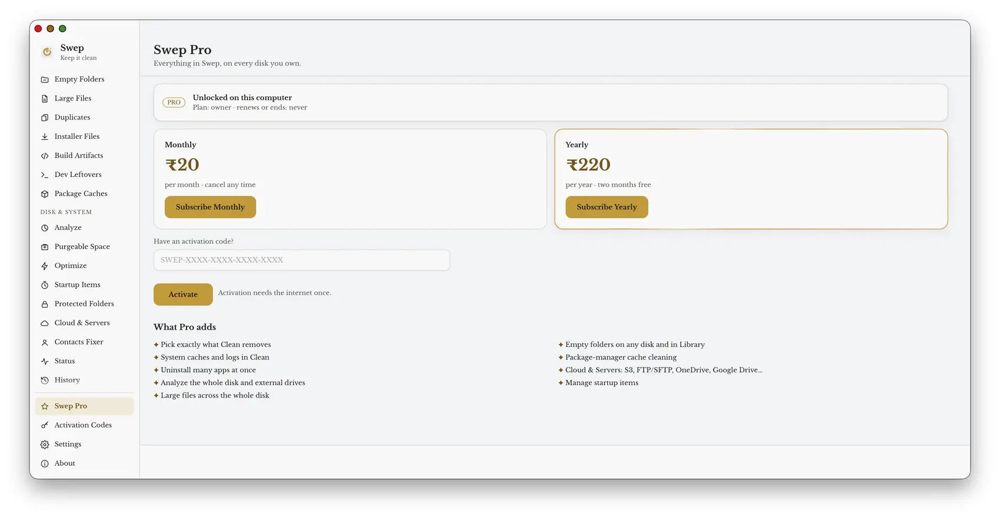

<p align="center">
  
  &nbsp;&nbsp;
  
</p>

<h1 align="center">Swep</h1>

<p align="center">Keep your computer clean — caches, app leftovers, empty folders, large files, duplicates and an AI clean that explains itself. Nothing is removed until you say so.</p>

<p align="center">
  <a href="https://ipconfig.co.network/swep"></a>
  <a href="https://github.com/JKS-sys/swep-releases-30-sep-2026/releases/latest"></a>
  <a href="https://github.com/JKS-sys/swep-releases-30-sep-2026/releases"></a>
  
</p>

<p align="center">
  <a href="https://ipconfig.co.network/swep">Website</a> ·
  <a href="https://github.com/JKS-sys/swep-releases-30-sep-2026/releases/latest">Latest release</a> ·
  <a href="https://github.com/JKS-sys/swep-releases-30-sep-2026/releases">All releases</a> ·
  <a href="https://ipconfig.co.network/updates/swep/RELEASE_NOTES.md">Release notes</a>
</p>

<p align="center">
  <a href="https://ipconfig.co.network/swep"></a>
  <br><sub>The website, <a href="https://ipconfig.co.network/swep">ipconfig.co.network/swep</a>, has every download, the release notes and the Pro plans.</sub>
</p>

## Download Swep 0.2.5 (08-oct-2026)

| System | Download |
|---|---|
| macOS, Apple Silicon | [Swep_0.2.5_aarch64.dmg](https://github.com/JKS-sys/swep-releases-30-sep-2026/releases/download/v0.2.5/Swep_0.2.5_aarch64.dmg) |
| macOS, Intel | [Swep_0.2.5_x64.dmg](https://github.com/JKS-sys/swep-releases-30-sep-2026/releases/download/v0.2.5/Swep_0.2.5_x64.dmg) |
| Windows | [Swep_0.2.5_x64-setup.exe](https://github.com/JKS-sys/swep-releases-30-sep-2026/releases/download/v0.2.5/Swep_0.2.5_x64-setup.exe) |
| Linux (AppImage) | [Swep_0.2.5_amd64.AppImage](https://github.com/JKS-sys/swep-releases-30-sep-2026/releases/download/v0.2.5/Swep_0.2.5_amd64.AppImage) |
| Linux (Debian/Ubuntu) | [Swep_0.2.5_amd64.deb](https://github.com/JKS-sys/swep-releases-30-sep-2026/releases/download/v0.2.5/Swep_0.2.5_amd64.deb) |
| Homebrew cask (no tap needed) | [swep.rb](https://github.com/JKS-sys/swep-releases-30-sep-2026/releases/download/v0.2.5/swep.rb) |
| One-line installer | [install.sh](https://github.com/JKS-sys/swep-releases-30-sep-2026/releases/download/v0.2.5/install.sh) |

The command-line tool `sp` is inside the macOS app (Swep Pro).

## Install

**One line (macOS, Apple Silicon or Intel)** — downloads the newest signed release, checks it, and puts Swep in /Applications:

```bash
curl -fsSL https://ipconfig.co.network/updates/swep/install.sh | bash
```

**Homebrew — no tap, no extra repository.** The cask file comes with every release; Homebrew installs it from a local copy:

```bash
curl -fsSL https://ipconfig.co.network/updates/swep/swep.rb -o /tmp/swep.rb && brew install --cask /tmp/swep.rb
```

(`brew upgrade --cask /tmp/swep.rb` with a fresh copy updates it; Swep also updates itself from Settings.)

**Downloads:** [ipconfig.co.network/swep](https://ipconfig.co.network/swep) or the [latest GitHub release](https://github.com/JKS-sys/swep-releases-30-sep-2026/releases/latest) — `.dmg` for macOS, `_x64-setup.exe` for Windows, `.deb` and `.AppImage` for Linux.

**Linux:** `sudo apt install ./Swep_*_amd64.deb`, or `chmod +x Swep_*_amd64.AppImage && ./Swep_*_amd64.AppImage`.
**Windows:** run `Swep_*_x64-setup.exe`.
**The sp command** comes inside the app: Settings → Command line → Install sp (Swep Pro).

## What it looks like

<table>
  <tr>
    <td width="50%"><a href="assets/clean.webp"></a><br><b>Clean</b> — one scan finds user and system caches, logs, every browser's cache, developer tools, Rust and dependency leftovers, temporary files and the data of apps you removed. Tick what goes; the scan and the clean keep running while you look at other pages.</td>
    <td width="50%"><a href="assets/history.webp"></a><br><b>History</b> — every clean, when it happened and how much it freed, with the lifetime total. Copy it out as CSV.</td>
  </tr>
  <tr>
    <td><a href="assets/settings.webp"></a><br><b>Settings</b> — light, dark or automatic; a Dock icon that follows; Trash or delete for good; sounds and animations; Full Disk Access; Touch ID for sudo; a clean reminder; crash reports and diagnostics in one place.</td>
    <td><a href="assets/pro.webp"></a><br><b>Swep Pro</b> — ₹20 a month or ₹220 a year, or an activation code. Everything in Swep, on every disk you own.</td>
  </tr>
</table>

## Free and Pro

| | Free | Pro (₹20/month · ₹220/year · or an activation code) |
|---|:---:|:---:|
| Clean: caches, logs, developer leftovers, app caches, games, temporary files | ✓ | ✓ |
| Clean: untick individual items before cleaning; system caches | | ✓ |
| AI Clean: Swep's built-in model scores junk, AI-tool caches, leftovers and unwanted downloads, explains each one, and removes what you agree with | ✓ | ✓ |
| AI Clean: a second opinion from a language model running on your computer (Ollama, LM Studio) | | ✓ |
| Leftovers, Installer Files, Build Artifacts, Dev Leftovers | ✓ | ✓ |
| Empty Folders, Large Files, Duplicates, Analyze — in your home folder | ✓ | ✓ |
| …on other disks, network shares and cloud folders (iCloud Drive, OneDrive, Google Drive, Dropbox) | | ✓ |
| Uninstall apps with every leftover — one at a time (your password asked once at most) | ✓ | ✓ |
| Uninstall many apps at once; find apps you have not opened for months | | ✓ |
| Package Caches, Startup Items | | ✓ |
| Cloud & Servers (S3, FTP/SFTP, OneDrive, Google Drive… via rclone) | | ✓ |
| AI Models: find and remove local models (Ollama, LM Studio, Hugging Face, .gguf…) | ✓ | ✓ |
| Contacts: view every field, export a .vcf that iCloud, Google and phones accept | ✓ | ✓ |
| Contacts: fix numbers and duplicates, edit, add, delete, import, send between accounts and iCloud accounts | | ✓ |
| Overview, Purgeable Space, Free Up Memory, Status (battery and SSD health), History, Protected Folders, Touch ID for sudo | ✓ | ✓ |
| The `sp` command line (previews are free; making changes is Pro) | | ✓ |

## What's new in 0.2.5

- Rebuilt on Tauri: the app is a few megabytes instead of a few hundred, starts instantly and uses far less memory.
- Deep Clean: system and user caches, logs, browser and developer-tool leftovers, and data left by removed apps — with a preview, and Pro can untick anything before cleaning.
- Uninstall shows every leftover file with its size before anything is removed, and Pro removes many apps at once.
- New: Empty Folders — finds folders with nothing real inside (only .DS_Store-type litter at most) and removes them safely. Also in the CLI as `sp empty`.
- New: Large Files, Installer Files, Build Artifacts, Package Caches, Startup Items, Purgeable Space, Status and History.
- Analyze measures folders on every core at once, remembers what it measured, and works on the startup disk and external drives.
- Removing a file macOS protects is reported as kept, not as an error.
- Closing the window quits Swep completely.
- Light and dark themes, and a Dock icon that follows them.
- Gentle sounds and animations — a sweep and a spark when a clean finishes. Both can be turned off in Settings.
- Purgeable Space shows how much macOS is holding back and reclaims it in one click, for everyone. Also `sp purgeable`.
- The `sp` command does the full job on its own: `sp clean`, `sp uninstall "App" --apply`, `sp optimize`, `sp purge`, `sp empty` — previews first, `--apply` to act.
- Every build bundles the newest cleaning runtime, checked before it is used.
- Updates: Swep asks GitHub, the GitHub mirror and ipconfig.co.network at once, shows what each one has, and installs the newest signed version with a live progress bar. The version number rolls over like an odometer.
- `sp update` updates the command line the same way, signature checked.
- Each release is uploaded to R2 and the previous installers there are deleted once the new one is live.
- If the site's routes are missing, licences and updates carry on through the Worker's own address.
- A launch animation, a radar sweep while scanning, rows that fly away when removed, calm empty states, a theme switch that ripples out from the click, and many more sounds — with Full, Subtle and Off levels.
- Fixed: `sp disk --path ~` and piping `sp` into another command no longer crash; problems are written to ~/.swep/crash.log.
- Selecting rows plays rising notes, a drag-select leaves a trail of stars, and every finished item in a deep clean ticks while a live counter shows what has been cleaned so far.
- Status has animated gauges and a heartbeat line; new activation codes unscramble into place; page titles cascade in.
- Clean now removes developer leftovers too: Rust's cargo caches, unpacked sources, git checkouts and rustup downloads (and old toolchains, or all of ~/.cargo and ~/.rustup once Rust is uninstalled); folders and broken commands left by tools you removed; shell startup lines that point at removed tools; Homebrew packages nothing needs and its old versions; and npm, Yarn, pnpm, Bun, pip, uv, Go, CocoaPods, SwiftPM, Gradle and Maven caches. Also on its own page and as `sp dev`.
- Protected Folders: anything inside them is never cleaned, from any page or command (`sp protect`).
- Touch ID for sudo can be turned on and off in Settings (`sp touchid`).
- Status shows the apps using the most memory and live network speed.
- Remove Swep in Settings takes the app, its settings and the sp command away cleanly.
- `sp completion zsh|bash|fish` adds tab completion.
- Full Disk Access now survives updates: every build is signed with the same certificate.
- Install with Homebrew in one command and no tap: `curl -fsSL https://ipconfig.co.network/updates/swep/swep.rb -o /tmp/swep.rb && brew install --cask /tmp/swep.rb` — or without Homebrew, `curl -fsSL https://ipconfig.co.network/updates/swep/install.sh | bash`.
- Duplicates: finds files that are identical byte for byte (size, samples, then a full SHA-256) and keeps the oldest copy unless you choose otherwise. Also `sp dupes`.
- Contacts Fixer: removes invalid numbers and repeats, merges duplicate contacts, deletes empty ones and can add country codes — in the Contacts app with iCloud, Google and Exchange accounts (changes sync), or in any .vcf file. Backed up first. Also `sp contacts`.
- Free Up Memory on the Clean page and in the menu (`sp ram`).
- Empty Folders, Large Files and Duplicates work everywhere: external disks, network shares, iCloud Drive, OneDrive, Google Drive, Dropbox and Box folders. Online-only cloud files are never counted as taking space.
- Cloud & Servers: large files and empty folders on Amazon S3, FTP/SFTP, WebDAV, OneDrive, Google Drive and more, through rclone (`sp cloud`).
- Cleaning also covers Tauri and Rust caches and build folders, temporary files, and the Trash and ._ litter on external disks.
- Package Caches measures where each tool really keeps its cache, so the sizes are complete.
- Things that macOS keeps or an app recreates no longer reappear in Empty Folders and command-line leftovers; anything that needs a password gets one retry with it (`sp hidden` lists them).
- Select All in every list; Analyze no longer takes over another page you switch to while it measures.
- Works in any window size: the page list scrolls while Swep Pro, Settings and About stay pinned at the bottom; Status and Activation Codes text stays readable and inside its boxes; words like "Temporary files" no longer lose their space.
- Activation codes can only be made from Swep on the owner's Mac.
- A subscription paid while Swep was closed is picked up at the next launch.
- `sp` gained interactive pickers: `sp uninstall`, `sp large`, `sp empty`, `sp dupes`, `sp cloud`, `sp ai`.
- Contacts: every account separately — iCloud, Google, Exchange and On My Mac on this Mac — plus any number of iCloud accounts directly on the internet (so every iPhone syncing with them). See every field including notes; add, edit, delete; export and import .vcf; send or move contacts between accounts; fix problems per account.
- Invalid numbers are judged by country: a number that cannot exist (like 455457575745745) is caught even when it carries a country code.
- AI Models: finds Ollama, LM Studio, Hugging Face, PyTorch, Whisper, GPT4All, Jan, Draw Things, DiffusionBee and ComfyUI/Stable Diffusion models, and loose .gguf/.safetensors/.ckpt files, and removes the ones you pick (`sp ai`).
- Much more to clean: VS Code, Cursor and other editors' caches, Slack, Discord, Teams, Spotify, Notion and Figma caches, Xcode DerivedData and old device support, iPhone update files and backups, Adobe media cache, Mail downloads, old JetBrains and Gradle versions, Docker's unused data.
- Free Up Memory now measures memory that is truly free, so you can see what it released.
- The app no longer freezes on a slow or sleeping disk, switching pages quickly stops the scans you left, and nothing runs on the main thread that could hang it.
- sp: one Esc (or Left arrow) goes back; arrow keys in every terminal style work; nothing crashes or hangs on navigation keys. sp now comes inside the app (Swep Pro) and updates with it.
- The sidebar scrollbar shows when the pointer is over it.
- Invalid phone numbers are always judged against your home country (taken from your Mac's region), so a number like 455457575745745 is caught without ticking anything; adding country codes is a separate choice.
- Free Up Memory asks for your password once at most: choose Always Allow and Swep may run macOS's own purge tool without asking again.
- Contacts shows every field — names, nickname, company and department, job title, phones, emails, websites, addresses, birthday and notes — read straight from each account. Each account (iCloud, Google, Exchange, On My Mac, iCloud on the internet) stands on its own; filter, sort, and Copy All to another account without making duplicates.
- Switching pages quickly no longer piles up scans: one scan of each kind runs at a time, recent results are reused, and answers for a page you already left are dropped.
- Much more to clean: browser caches, every sandboxed app's cache, old crash reports, Homebrew logs, Poetry, Deno, Electron, Prisma, Turborepo, Terraform, Zig and Unity caches, Playwright/Puppeteer/Cypress browsers, old "Install macOS" apps; and more places where removed apps leave things behind.
- A gold light sweeps across page titles, numbers glow when they change, toasts bounce in, tabs click and cleaning starts with a broom sweep.
- More life: gold confetti and a fanfare when a clean frees more than 1 GB or Pro turns on, cards that lean toward the pointer with a soft sheen, checkboxes and buttons that click, counters that tick as they count, errors that shake, a logo that breathes and spins when clicked, gentle key clicks while typing in search boxes, and a morning chime for the light theme and a night chime for the dark one.
- Monthly (₹20) and yearly (₹220) Pro plans, plus activation codes.
- Updates come from GitHub first, then the ipconfig.co.network mirror.
- AI Clean, for everyone: a page (and `sp smart`) that scores junk from 0 to 100 and explains every score — caches and downloads of AI tools, tiny junk files, leftovers of removed apps, stale downloads and installers, and files nothing has opened in a very long time. Items at 80 or more are picked for you; nothing is removed until you say so, and "Not junk" keeps a file out for good. Pro can ask a model running on this Mac (Ollama or LM Studio) for a second opinion.
- Fixed: uninstalling several apps, or anything that needs a password, now asks once. Swep opens a single prompt and the whole run uses that answer; declining it continues with everything that needs no password.
- Fixed: Contacts export writes vCards that iCloud, Google and Exchange accept — no more "invalid data" on import.
- Fixed: the progress panel stays in view while Swep works, however far the list is scrolled.
- Fixed: a clean or scan keeps running while you look at other pages; the Clean item in the sidebar shows its state and the results are still there when you come back. A stopped scan is no longer reused.
- Overview: a home page with disk rings, the biggest folders, one-click Quick Clean and the latest numbers.
- Colour everywhere: paths, sizes, numbers, dates, brackets, commands and code are coloured by meaning in every list, log and window (blue, teal, amber, violet, olive, brown, gold and slate — never pink), with the same contrast checked for both themes.
- Status shows memory pressure, thermal state, Low Power Mode, battery health and cycles, SSD wear and SMART status.
- More leftovers found: Containers and Group Containers, saved application state, HTTP storage, WebKit data, caches, logs, preferences, cookies, crash reports and folders named after apps that are gone — matched by bundle identifier, vendor and name, and never for anything still installed or running.
- Much more to clean: every browser profile's caches, app updaters, Xcode archives and simulators, Docker and OrbStack, Android Studio, chat and media caches, game launcher caches, privacy traces, and dozens more package-manager caches — with Windows and Linux equivalents.
- Uninstall can show only apps you have not opened for months, sorted by last use, and follows the Trash setting (to the Trash, or for good).
- Diagnostics: crash reports (Swep, sp and macOS crash logs) are collected in Settings, can be copied or cleared, and Swep says so after a crash. Keyboard Shortcuts (⌘/) lists every key.
- Settings can remind you to clean after a while, and bring back everything you hid.
- Large Files filters by kind and age; every list has a filter box (⌘F) in its bottom bar.
- More sounds and motion: a sweeping broom while cleaning, a thinking brain on AI Clean, score rings that fill, battery and gear sounds in Status, a done card that counts what was freed, nav badges that pulse, and the sidebar that waves when a long job finishes.
- The GitHub README shows the website, the latest release, screenshots with descriptions, the curl installer and the no-tap Homebrew command; every release uploads its release notes, the changelog, the cask file and the installer to R2, and the previous installers are deleted from GitHub once the new release is live.
- Smaller app: the cleaning runtime ships compressed and unpacks on first use, the bundled `sp` no longer carries a second copy of it, and the icons are a third of their size.
- Fixed: a scan you cancel is not kept as if it had finished; an uninstall that needs no password never asks for one; binary Info.plist files are read correctly; version-number folders are not mistaken for bundle identifiers.

On macOS, if the app is reported as damaged, run: `xattr -cr /Applications/Swep.app`

## Features

- **Overview** — your disk as a ring (used, purgeable, free), what Swep has freed in total, when it last cleaned, and one-click ways in.
- **Clean** — system and user caches, logs, every browser's cache (Chrome, Edge, Brave, Arc, Vivaldi, Opera, Firefox, LibreWolf, Zen…), developer tools, chat and media apps, games, and data left by removed apps — with a full preview first. A scan or a clean keeps going while you visit other pages, and is waiting when you come back. Pro can untick anything and include system caches.
- **AI Clean** — Swep's own model scores AI-tool caches (Ollama, LM Studio, Hugging Face, PyTorch, Claude, ChatGPT, Codex, Cursor…), tiny junk (.DS_Store, __MACOSX, ._ files, broken shortcuts, abandoned downloads, Python caches), leftovers of removed apps and unwanted downloads from 0 to 100, says why in words, ticks what it is sure about, and removes what you agree with. Works offline, for everyone. Pro can ask a local language model for a second opinion.
- **Uninstall** — every leftover of an app (caches, preferences, containers, launch agents, logs) listed with its size before anything goes; your password is asked once at most, however many apps you remove together. See which apps you have not opened for months. Pro removes many apps at once.
- **Leftovers** — data from apps you already deleted, matched by bundle identifier (containers and group containers included) and, more carefully, by folder name.
- **Empty Folders** — folders with nothing real inside, found on every core at once and removed safely (only if still empty).
- **Analyze** — what takes the space on the startup disk, your home folder or an external drive; folders measured in parallel and remembered.
- **Large Files** (by kind and age), **Installer Files** and **Build Artifacts** (node_modules, Rust target, Python venvs, Pods…).
- **Purgeable Space** — see how much macOS holds back as purgeable and reclaim it in one click.
- **Optimize** — DNS, Spotlight, QuickLook, LaunchServices, fonts, Dock and Finder refresh, plus a health and security check.
- **Developer Leftovers** — Rust caches and old toolchains, folders and broken commands left by removed tools, shell lines that point at them, Homebrew packages nothing needs, Xcode and simulator leftovers, Docker and OrbStack caches, and npm/Yarn/pnpm/Bun/pip/uv/Poetry/Go/CocoaPods/SwiftPM/Gradle/Maven/Conda/NuGet/Bazel caches. Part of every Clean.
- **Privacy traces** — recent-items lists, the download history record and shell histories, never pre-selected.
- **Protected Folders** — never cleaned, from any page or command.
- **Duplicates** — identical files by full SHA-256; the oldest copy is kept. **Contacts Fixer** — invalid numbers, repeats, duplicate contacts, empty contacts, country codes; in the Contacts app (iCloud, Google, Exchange sync) or a .vcf file; exports a .vcf that iCloud, Google and phones accept.
- **Everywhere** — Empty Folders, Large Files and Duplicates on external disks, network shares and cloud folders; **Cloud & Servers** for S3, FTP/SFTP, OneDrive, Google Drive via rclone.
- **Status** — disk, memory, load, network, the apps using the most memory, battery health and cycles, SSD health, memory pressure and thermals.
- **Free Up Memory**, temporary files, Tauri and Rust caches, external-disk litter.
- **Touch ID for sudo**, **Remove Swep**, tab completion for `sp`, a clean reminder, crash reports and diagnostics in Settings.
- **Package Caches** and **Startup Items** (Pro) and **History** (with CSV export).
- Click, Shift-click, drag across rows, or hold Space with the arrow keys to select; filter any list; Trash or delete for good.
- Light and dark themes from the icon's palette with a readable rainbow for paths, sizes, numbers and brackets (no pink); a Dock icon that follows; sounds and animations for everything (both can be turned off).
- Closing the window quits completely. Updates are signed and checked before they install.

---

Made by Jagadeesh Kumar S — [ipconfig.co.network/swep](https://ipconfig.co.network/swep) · [NewsCraft Studio](https://www.youtube.com/@JKS-sys)
